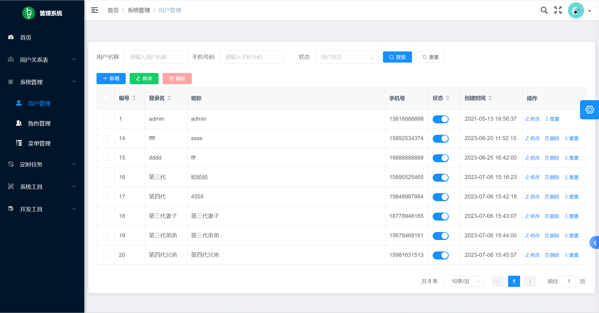
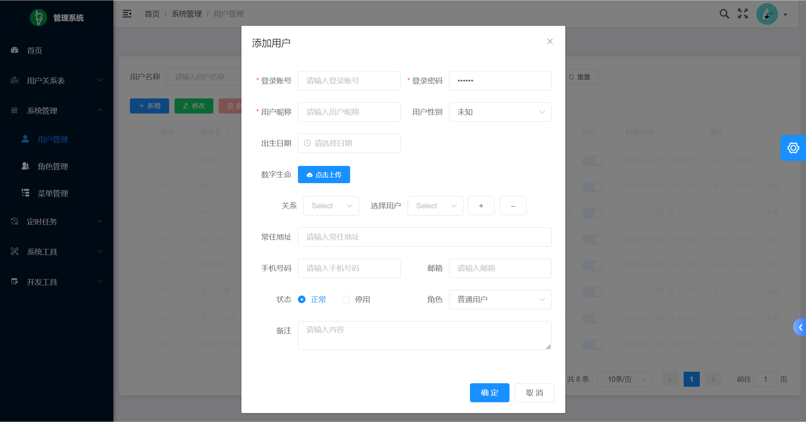
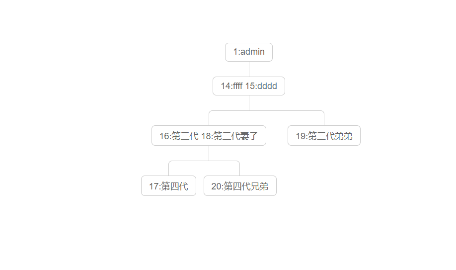

# 族谱系统的api
需要安装golang语言环境
基于goadmin开发：https://github.com/go-admin-team/go-admin

示例：family.fengsha.space
账号：admin
密码：admin





使用说明：
以下步骤都是在当前项目根目录执行
### 安装好mysql8.0以上版本，然后导入项目根目录的install.sql
### 第一步：修改配置文件
配置数据库连接：
config/settings.yml
把端口号：port，数据库：database配置即可
```yaml
settings:
  application:
    # 端口号
    port: 888 # 服务端口号
  database:
    # 数据库类型 mysql, sqlite3, postgres, sqlserver
    # sqlserver: sqlserver://用户名:密码@地址?database=数据库名
    driver: mysql
    # 数据库连接字符串 mysql 缺省信息 charset=utf8&parseTime=True&loc=Local&timeout=1000ms
    #root:fengsha888@tcp(192.168.56.80:3306)/goadmin //账号:密码@tcp(数据库的地址:端口)/数据库名称
    source: root:fengsha888@tcp(192.168.56.80:3306)/goadmin?charset=utf8&parseTime=True&loc=Local&timeout=1000ms
```
### 第二步：生成执行文件
```shell
go build main.go
```
### 第三步：启动项目(windows是main.exe文件,main是linux文件)
```shell
##
# linux启动
# main server -c config/settings.yml
### windows
main.exe server -c config/settings.yml
```
启动成功后切勿关闭当前窗口，关闭窗口意味着系统关闭

